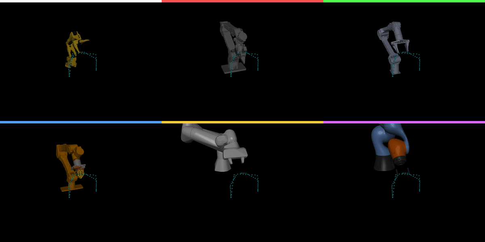
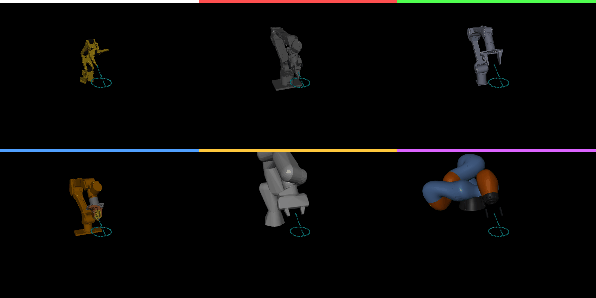

# DOF-Retargetting

URDF-based trajectory retargeting for moving demonstrations between robot arms
with different degrees of freedom.




This package converts a demonstration recorded on one
arm into the equivalent joint trajectory on a different arm — including arms with
a different number of degrees of freedom (e.g. SO101 5-DOF -> B601 6-DOF).

You only need the source trajectory and the two arm URDFs. No knowledge of the
original room or table setup is required.

FK and IK are delegated to:

```text
lerobot.model.kinematics.RobotKinematics
```

That backend uses `placo`. This repo does not implement its own IK solver.

It needs:

- `numpy`
- `lerobot[kinematics]`
- source/target URDF files
- a source trajectory file (`.npz`, `.npy`, `.pkl`, or `.pickle`)
- target TCP link and joint names

Optional GIF rendering needs:

- `matplotlib`
- `imageio`

For full environment details, see [REQUIREMENTS.md](REQUIREMENTS.md). For a
step-by-step install and first run, see [SETUP.md](SETUP.md).

## Validation Results

The repo includes the recent validated GIF outputs under
`validation/outputs/`:

- `validation_pick_place.gif`: SO101 pick-place trajectory retargeted across
  B601, Piper, Panda, Kuka, and Yam arms.
- `validation_wipe_circle.gif`: SO101 wipe-circle trajectory retargeted across
  the same target arms.
- `grasp_physics.gif`: MuJoCo grasp-tracking check for the retargeted grasp
  motion.

Generated `.npz` validation data and caches are intentionally ignored so the
GitHub repo stays focused on the retargeting package and the final visual
results.

## Core Idea

Picture both arms dropped into a simulator and **clamped to the same spot** — their
base mounting platforms coincident at the world origin. Under that assumption the
end-effector path is arm-agnostic and can be carried from one arm to the other:

```text
source joints
  -> forward kinematics (source URDF)        # TCP pose in the source base frame
  -> re-express in the shared frame: mount point at origin, canonical TCP orientation
  -> re-express on the target arm (target mount point, target TCP convention)
  -> LeRobot RobotKinematics IK (target URDF)
  -> smoothed target joint trajectory
  -> .npz action file
```

Two details make the transfer physically correct, both derived automatically from
each URDF (`tools/inspect_tcp_convention.py` prints them):

**Mount-point alignment (positions).** The arms are aligned at the **top-center of
the base platform** where they are clamped — taken as the first-joint origin, the
point the arm chain rises from — not at whatever spot each URDF happens to place
its `base_link` origin. Without this, an arm whose `base_link` sits at the bottom
of its base would be vertically (and horizontally) misaligned against one whose
`base_link` sits elsewhere. Disable with `--no-base-align` to coincide the raw
`base_link` origins instead.

**Canonical TCP frame (orientation).** Two arms rarely define their gripper/TCP
link with the same axis convention, so a raw roll-pitch-yaw copy would twist the
wrist. Each arm is assigned a shared **canonical/grasp TCP frame**:

- `z` = gripper approach axis (the TCP point relative to the wrist center)
- `y` = the gripper's jaw-opening axis, in priority order:
  1. an explicit `--source/target-gripper-axis x,y,z` (in the TCP frame), else
  2. the **moving-jaw axis** read from the URDF, if the gripper is modelled, else
  3. the **wrist-flex axis** (the last non-roll revolute parallel to the
     shoulder-lift axis). Disable jaw geometry with `--no-jaw-geometry`.
- `x` = `y x z`

Using the flex/jaw axis (rather than "the second-to-last revolute") is what keeps a
5-DOF wrist and a 6-DOF wrist aligned: the extra wrist joint on a 6-DOF arm is a
*yaw*, and anchoring to it would rotate the gripper ~90 degrees. The constant
rotation from an arm's native TCP frame to this convention is computed once from
the URDF. Disable all orientation alignment with `--no-tcp-align`.

The DOF mismatch is absorbed by IK, which matches the Cartesian path of the hand
rather than mapping joints one-to-one.

## Install

From this folder:

```bash
python -m pip install -e .
```

The package pins LeRobot to:

```text
lerobot[kinematics] @ git+https://github.com/Seeed-Projects/lerobot.git@0f392484458cb5ebca0310c0c4c47390a31c80ed
```

If you are developing against a local LeRobot checkout instead, install it first:

```bash
python -m pip install -e "/path/to/lerobot[kinematics]"
python -m pip install -e .
```

For rendering:

```bash
python -m pip install -e ".[render]"
```

You can also run tools directly without installing:

```bash
python tools/retarget_trajectory.py --help
```

## Inspect The Canonical TCP Frame (optional)

Before retargeting, check that both arms agree on what "out of the gripper" means:

```bash
python tools/inspect_tcp_convention.py \
  --urdf /path/to/source_robot.urdf \
  --tcp-link gripper_frame_link

python tools/inspect_tcp_convention.py \
  --urdf /path/to/target_robot.urdf \
  --tcp-link gripper_tcp
```

The printed `approach_axis_base` for each arm should point out of its gripper.

## Retarget Joint Trajectories

Example for a source joint trajectory stored in an `.npz`:

```bash
python tools/retarget_trajectory.py \
  --input /path/to/source_episode.npz \
  --output outputs/source_to_target.npz \
  --source-mode joints \
  --source-urdf /path/to/source_robot.urdf \
  --source-tcp-link gripper_frame_link \
  --source-joint-names shoulder_pan,shoulder_lift,elbow_flex,wrist_flex,wrist_roll \
  --input-data-key joint_positions_rad \
  --input-joint-slice 0:5 \
  --input-time-key timestamps_s \
  --target-urdf /path/to/target_robot.urdf \
  --target-tcp-link gripper_tcp \
  --target-joint-names joint1,joint2,joint3,joint4,joint5,joint6 \
  --target-output-joint-names shoulder_pan,shoulder_lift,elbow_flex,wrist_flex,wrist_yaw,wrist_roll
```

Orientation is matched by default (`--orientation-weight 1.0`). If the two arms
are too different for the wrist orientation to be reachable, lower it (down to
`0.0` for position-only matching).

The output `.npz` contains:

- `source_end_effector_poses`
- `canonical_ee_poses`
- `desired_target_poses`
- `raw_target_joint_positions_rad` / `..._deg`
- `smoothed_target_joint_positions_rad` / `..._deg`
- `achieved_target_poses`
- `target_action_positions_deg`
- `target_action_names`
- `position_errors_m`
- `orientation_errors_rad`
- `source_canonical_rotation`, `target_canonical_rotation`
- `source_mount_offset`, `target_mount_offset`, `base_position_shift`
- `ik_success`, `ik_backend`

## Retarget Existing TCP Pose Trajectories

If the source file already stores TCP poses in the source base frame:

```bash
python tools/retarget_trajectory.py \
  --input /path/to/source_ee_poses.npz \
  --output outputs/source_poses_to_target.npz \
  --source-mode poses \
  --input-data-key ee_poses_base \
  --input-time-key timestamps_s \
  --source-urdf /path/to/source_robot.urdf \
  --source-tcp-link gripper_frame_link \
  --target-urdf /path/to/target_robot.urdf \
  --target-tcp-link gripper_tcp \
  --target-joint-names joint1,joint2,joint3,joint4,joint5,joint6
```

In `poses` mode, `--source-urdf` / `--source-tcp-link` are used only to derive the
source canonical TCP frame for orientation alignment. Omit them (or pass
`--no-tcp-align`) to treat the stored poses as already canonical.

## Gripper Mapping

Arm motion is solved by LeRobot IK. Gripper motion is mapped separately as openness.

```bash
--source-gripper-key gripper_open_fraction \
--source-gripper-units fraction \
--target-gripper-name gripper \
--target-gripper-open-deg -228.09 \
--target-gripper-closed-deg 10.98
```

If the source gripper is not already a fraction, provide raw open/closed values:

```bash
--source-gripper-open-value 800 \
--source-gripper-closed-value 120
```

## Estimate A Gripper TCP

For URDFs whose terminal link is not a task TCP:

```bash
python tools/estimate_gripper_tcp_from_urdf.py \
  --urdf /path/to/robot.urdf \
  --link end_link \
  --output-urdf /path/to/robot_with_tcp.urdf
```

This is a mesh heuristic. Verify the TCP visually or on hardware for precise grasping.

## Compare Source And Retargeted Trajectories

Because the bases are taken to coincide, the default (identity) world poses compare
the source and achieved end-effector paths directly:

```bash
python tools/compare_world_trajectories.py \
  --retargeted-npz outputs/source_to_target.npz
```

## Render A GIF

LeRobot's kinematics API uses degrees, so use the degree trajectory key unless you pass `--joint-units rad`.

```bash
python tools/render_urdf_trajectory_gif.py \
  --trajectory outputs/source_to_target.npz \
  --urdf /path/to/target_robot.urdf \
  --target-link gripper_tcp \
  --joint-data-key smoothed_target_joint_positions_deg \
  --joint-units deg \
  --joint-names joint1,joint2,joint3,joint4,joint5,joint6 \
  --desired-poses-key desired_target_poses \
  --time-key replay_timestamps_s \
  --output outputs/source_to_target.gif
```

## Included Example Asset

The folder includes a B601-style URDF asset under:

```text
examples/assets/rebot_b601/reBot-DevArm_fixend_description/urdf/reBot-DevArm_fixend.urdf
```

This is included only as an example target asset. The retargeter itself is generic.
The copied URDF uses relative mesh paths so LeRobot/placo can load it outside the original reBot repo.

## What This Does Not Do

This package does not control real hardware, record episodes, or start MeshCat. Those layers are robot-specific and should live in a separate hardware adapter.

This package produces retargeted trajectory files. A hardware adapter should read `target_action_positions_deg` and `target_action_names` and send them to the robot.
